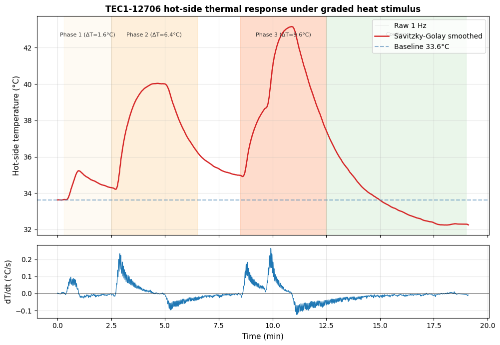

# Track 1 — TEC1-12706 Thermal Response Characterization

Hot-side temperature response of a Peltier module (TEC1-12706) operated in reverse
Seebeck mode under a three-phase graded heat stimulus.

## Setup

- **TEG module:** TEC1-12706, Bi₂Te₃, 40×40×4 mm, ~2.5 Ω internal
- **Cold-side heat sink:** Intel stock CPU cooler (Cu base + Al fins, passive)
- **Hot-side temperature sensor:** DS18B20 (12-bit, ±0.5 °C absolute), 1-wire
- **Logger:** ESP32-S3, sample rate ~1 Hz (jittered by DS18B20 conversion time)
- **Stimulus:** Silicone heat pad (~5 W), three intensity steps via programmable DC supply

## Protocol

| Phase | Intensity step | Target ΔT |
|---|---|---|
| Baseline | OFF | 0 °C (33.6 °C ambient) |
| Phase 1 | Low | +1.6 °C |
| Phase 2 | Medium | +6.4 °C |
| Phase 3 | High | +9.6 °C |
| Cooling | OFF | Return to baseline |

Total: 1107 samples over 19.1 minutes.

## Key result

Asymmetric thermal kinetics — rise τ ≈ 60 s vs decay τ ≈ 180 s — indicates the
cold-side path is the rate-limiting thermal resistance at this geometry. Peak ΔT
of 9.6 °C achieved at Phase 3.



## How to reproduce

```bash
pip install pandas numpy scipy matplotlib
jupyter lab analysis.ipynb
```

Run all cells. The figure `figures/fig1_thermal_response.png` is regenerated
from `data/teg_data_summary.csv`.

## Files

- `analysis.ipynb` — full analysis pipeline with Savitzky-Golay smoothing and exponential rise fits
- `data/teg_data_summary.csv` — raw data: `time_seconds, time_minutes, temperature_C`
- `figures/fig1_thermal_response.png` — main result figure

## Next steps (not in this folder)

P-vs-R_load characterization at fixed ΔT to extract internal resistance and
maximum power point, for comparison against literature wearable TEG benchmarks
(He et al. 2022, Newby et al. 2024).
