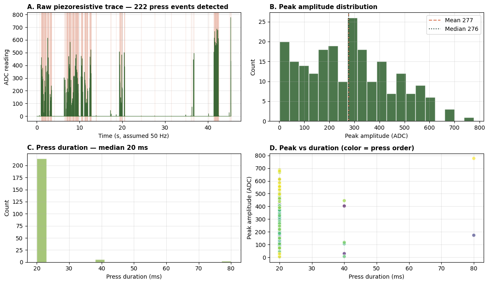

# Track 2 — DIY Piezoresistive Pressure Sensor

A three-layer pressure sensor assembled from household materials, characterized
through 222 manual press events over a 45-second demonstration.

## Materials (BOM under USD $1)

- **Dielectric layer:** EVA sponge (~3 mm, dishwashing pad)
- **Top electrode:** Aluminium foil, ~30×30 mm
- **Bottom electrode:** Steel wool (recovered from kitchen scrubber, ~5 mm matted)
- **Readout:** ESP32-S3 ADC via voltage divider
- **Firmware:** Threshold-gated logging (`Pressure:<value>`)

## Operating principle

Under compression, the EVA sponge thins, bringing the foil and steel-wool layers
closer. Bulk resistance through the structure decreases, raising the ADC reading
at the divider output.

## Key result

- **222 press events** detected in a 45-second demonstration
- Peak amplitude range: 1–777 ADC counts (mean 277, median 276)
- Distribution suggests two distinct press-intensity modes during the demo
- Median press duration of 20 ms suggests sampling rate (estimated 50 Hz) is at
  the temporal limit for brief manual taps



## How to reproduce

```bash
pip install pandas numpy matplotlib
jupyter lab analysis.ipynb
```

Run all cells. The figure `figures/fig_pressure_analysis.png` is regenerated
from `data/pressure_press_demo.csv`.

## Files

- `analysis.ipynb` — event detection + amplitude/duration/scatter analysis
- `data/pressure_press_demo.csv` — raw data: one `Pressure:<value>` line per sample
- `figures/fig_pressure_analysis.png` — 4-panel result figure

## Limitations

- Not force-calibrated; ADC values cannot be translated to Newtons
- Sampling rate (~50 Hz) undersamples brief taps
- Firmware threshold-gates zero values, precluding baseline drift recovery
- Sensor geometry has not been characterized for hysteresis

## Next iteration

(a) Calibrate against known masses (10–500 g); (b) raise sampling to 200 Hz;
(c) log raw un-thresholded ADC continuously; (d) characterize hysteresis on
loading/unloading cycles.
